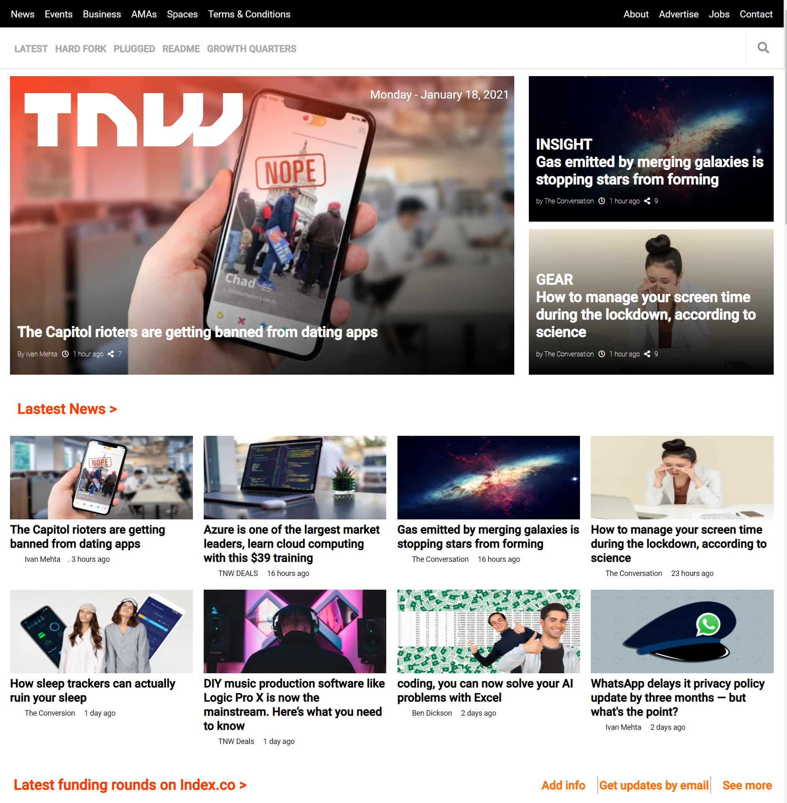

# thenextweb_clone

This is the second Microverse collaborative project

# The Next Web Clone

> This is the second Microverse collaborative project.

Additional description about the project and its features.

## Built With

- HTML & CSS

## Live Demo

[Live Demo Link](https://nganifaith.github.io/thenextweb_clone/)

## Authors

👤 **Author1**

- GitHub: [@RyelBanfield](https://github.com/ryelbanfield)
- Twitter: [@RyelBanfield](https://twitter.com/ryelbanfield)
- LinkedIn: [RyelBanfield](https://linkedin.com/ryelbanfield)

👤 **Author2**

- GitHub: [@nganifaith](https://github.com/nganifaith)
- Twitter: [@Bright_ngani](https://twitter.com/Bright_ngani)
- LinkedIn: [Kongnyu Faith Ngani](https://linkedin.com/ngani-faith)

## Contirbution

🤝 Contributing Contributions, issues and feature requests are welcome!

Feel free to check the issues page.

## Show your support

Show your support Give a ⭐️ if you like this project!

## 📝 License

This project is [MIT](LICENSE) licensed.
